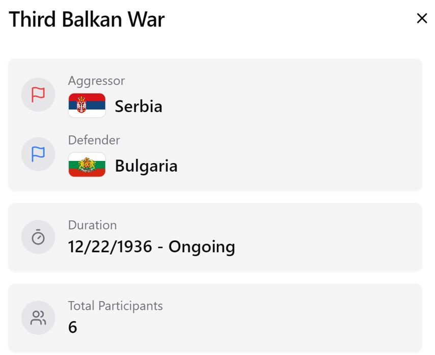

# Maps Modelier

A desktop application for creation of interactive political maps.

## Overview

### Features

- Create and view political maps
- Freely define geography and state borders
- Ethnicities and population of provinces and countries
- State attributes and governments
- Alliances and wars
- Different view modes (countries, ethnicities, population)

### Built With

- 
- 
- 
- 
- 
- 
- 
- 
- 
- 
- 
- 

### How to use

1. **Start screen**:
   - `Create New Map`
   - `Existing Maps` — list of existing maps with the ability to view, delete, or edit them.
  
To create own map you need to upload an image with provinces (you can use *provinces.png* image as an example).

1. **Map screen**:

Settings (the wheel icon on the right in the top panel) contain the interaction mode and the map view mode. The interaction mode can be *viewing* or *editing*, and the viewing mode can be *countries*, *ethnicities*, or *population*. You can also change the editing mode by pressing `Ctrl+E`.

When you left-click on a province, it becomes highlighted. Holding down the `Shift` key allows you to select several provinces at once. In the editing mode, if you have selected provinces, windows will pop up in the lower left corner of the screen to allow you to change the type of province, add population, and create states. You can close them by clicking on the cross or pressing the `Esc` key.

When you have a state created, clicking on a province will also highlight the state in which it is located. When a state is selected, holding down the `Ctrl` key and clicking on a province will add that province to the state. If the province was already part of another state, it will be automatically removed from it and transferred to the new one. If you click on a state's own province, it will be removed from the state and become unassigned.

Before you can add population to provinces, you need to create ethnicities, which is done in the ethnicities panel.
Before states can be added to countries, these countries have be created in the countries panel. After the country has been created, in order to put it on the map, you need to select a state and select the wanted country as its owner in the drop-down list. After the country has been placed on the map, you can also select the owner of each state from the drop-down list to further expand it. However, this is a long and inefficient process, so you can select a state that already belongs to the country and hold down the `Alt` key to click on the states to add them to country. Similarly to provinces, if you click on a state that already belongs to another country, it will automatically be transferred to the new country, and if you click on country's own state, it will become unassigned.
You can right-click on a country to select it and open a panel with information about it.

All other actions are performed in the corresponding panels located on the left side of the top panel.

### Screenshots

- Start screen

- New map dialog

- Map

- Province population form

- Province and state population

- Countries panel

- State attributes

- Demographics

- Politicians

- Parties

- Party

- Government

- Parliament

- Parliament (details)

- Alliance

- Alliances

- War

- War participants

- Wars

- Ethnicities mode

- Population mode

